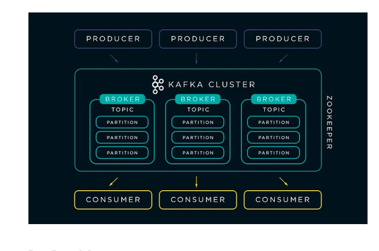

[Kafka Cluster with Docker Compose(]https://medium.com/@erkndmrl/kafka-cluster-with-docker-compose-5864d50f677e)




Basic Commands
Start ZooKeeper and Kafka using the Docker Compose Up.
```
docker-compose -f <docker-compose_file_name> up -d
```

1 Zookeeper — 1 Kafka:
```
docker-compose -f docker-compose-1zookeeper-1Kafka.yaml up -d
```

1 Zookeeper — 3 Kafka:
```
docker-compose -f docker-compose-1zookeeper-3Kafka.yaml up -d
```

3 Zookeeper — 3 Kafka
```
docker-compose -f docker-compose-3zookeeper-3Kafka.yaml up -d
```

In another terminal window, go to the same directory. Before we move on, let’s make sure the services are up and running:
```
docker ps -a
```
Check the ZooKeeper logs to verify that ZooKeeper is healthy. For example, for service zookeeper-1:
```
docker logs <zookeeper-1_containerId>
```
Verify that the ZooKeeper ensemble is ready:
```
docker run --net=host --rm confluentinc/cp-zookeeper:latest bash -c “echo stat | nc localhost <ZOOKEEPER_CLIENT_PORT> | grep Mode”
```

See the Kafka brokers.
```
docker logs <kafka-2_containerId>
docker logs <kafka-2_containerId>
docker logs <kafka-3_containerId>
```

fetck container id dynamically by containername
```
docker logs (docker ps -aqf "name=containername")
```

```
docker logs (docker ps -aqf "name=containername")
```
